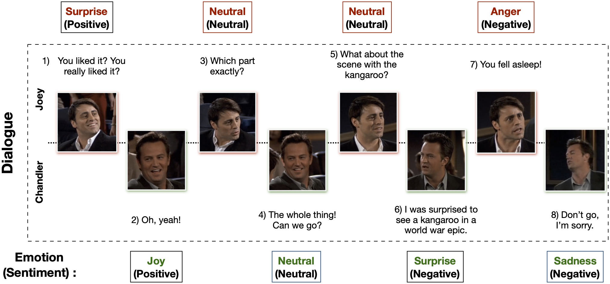

ERC is a task that aims at predicting emotion of each utterance in a conversation. The following is an excerpt of a conversation with each utterance tagged with corresponding emotion and sentiment label.

# Hierarchical Transformer Network for Utterance-Level Emotion Recognition
This is the Pytorch implementation Utterance-level Emotion Recognition [paper](https://arxiv.org/ftp/arxiv/papers/2002/2002.07551.pdf)

Overview: Though predicting the emotion of a single utterance or sentence, i.e. emotion detection, is a well discussed subject in natural language understanding literature, EmoContext has several novel challenges. In this paper, we address four challenges in utterance-level emotion recognition in dialogue systems:

- Emotion depend on the context of previous utterances in the dialogue

- Long-range contextual information is hard to be effectively captured;

- Datasets are quite small.

-  The prediction targets (emotion labels) are highly unbalanced. Some emotions are rarelyseen in daily-life conversations.   For example,  people are usually calm and exhibit aneutral emotion while only in some particular situations, they express strong emotions,like anger or fear. Thus we need to be sensitive to the minority emotions while relievingthe effect of the majority emotions.
 
In this work, we have implemented ’HiTransformer’, a transformer-based context and speaker-sensitive model proposed by [Qingbiao et al.](https://arxiv.org/ftp/arxiv/papers/2002/2002.07551.pdf).  Firstly, we utilize a pre-trained bidirectional transformer encoder BERT to generate local utterance represen-tations. BERT has been shown to be a powerful representation learning model in many NLP applications and can exploit contextual information more efficiently than RNNs and CNNs. Another high-level transformer is used to capture the global context information in conversations. To make our model speaker-sensitive, we introduce speaker embedding into our model.After obtaining the contextual utterance embedding vectors with a hierarchical transformerframework, we feed them into the fully connected layers for classification. Dropout is appliedon the fully connected layers to prevent overfitting and softmax layer is used to obtain a prob-ability distribution over the output classes.

# Datasets
One of the major challenges in emotion recognition in conversations task is to find a good la-beled dataset. However, there are a few standard famous datasets that are used by researchers for this task. We use following datasets for benchmarking our implementa-tion.
- Friends: This  dataset  is  annotated  from  the  scripts  of  Friends  TV  sitcom,  andeach dialogue in the dataset consists of a scene of multiple speakers. This dataset consists of 1000 dialogues, which are split into three parts: 720 for training, 80 forvalidation, and 200 dialogues for testing. Each utterance is tagged with an emotionlabel from a set of 8 emotions, anger, joy, sadness, neutral, surprise, disgust, fear,and non-neutral.
 
- EmotionPush:  The dataset consists of private conversations between friends onFacebook and includes 1000 dialogues, which are split into 720, 80, and 200 dia-logues for training, validation, and testing, respectively. Each utterance is taggedwith an emotion label from a set of emotions as in the Friends dataset.

- EmoryNLP:  This dataset is annotated from the Friends TVScripts as well. However, its size and annotations are different from the Friends dataset.It includes 713 dialogues for training, 99 dialogues for validation, and 85 dialogues fortesting.

- Semeval EmoContext:  This dataset includes a training dataset of 30160 dialogues, and two evaluation data sets, Test1 and Test2, containing 2755and 5509 dialogues respectively.  In this dataset, each dialogue consists of 3 utterancesand given a textual dialogue i.e.  an utterance along with two previous turns of context,the goal is to infer the underlying emotion of the 3rd utterance by choosing from fouremotion classes - Happy,  Sad,  Angry and Others.

# Train 
User can train the model using following commqand:

python EmoMain.py \
--gpu 0 \
--emoset friends \
--speaker_embedding \
--random \

# More Details
- Code supports four datasets as mentioned earlier. You can select one of them using emoset option.
- You can enable or disable speaker embedding using --speaker_embedding option.
- There are some other arguments in the EmoMain.py file, e.g., the decay rate for learning rate, batch size, number of epochs. You can find out and change them if necessary.

